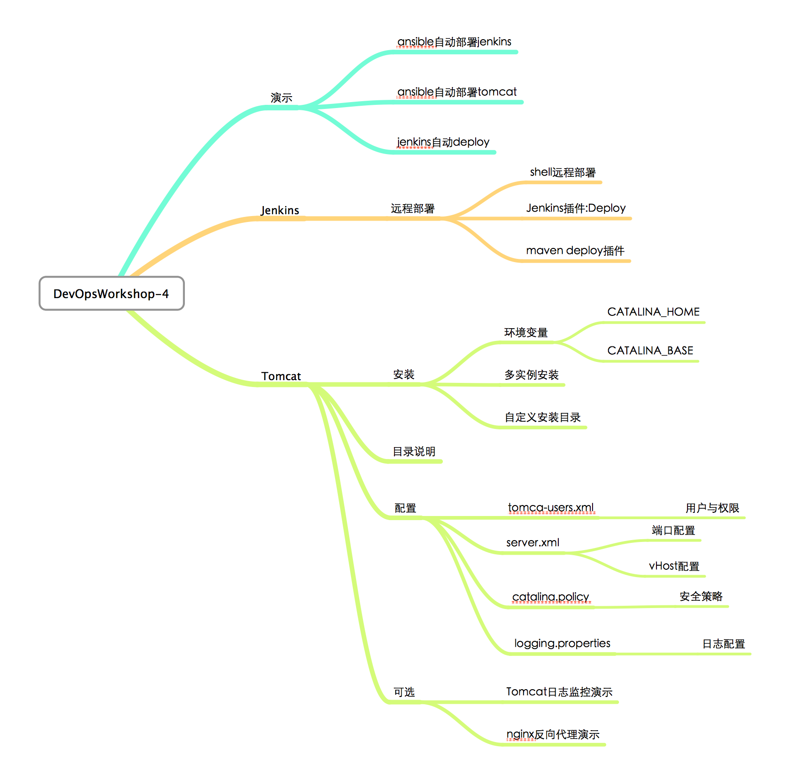

Workshop_3
==========

## 目标

> 利用jenkins自动部署应用

* 了解jenkins常用插件如：clone-workspace-scm，deploy
* 了解Tomcat的基本安装方式与策略（可选自定义目录安装）
* 了解Tomcat的常用配置如：用户与权限，端口，vhost，（可选安全策略配置）
* 可选扩展话题：Nignx方向代理-动静分离 Tomcat日志监控AWstatas

## 大纲

